```python
import pandas as pd
import matplotlib.pyplot as plt
import numpy as np 
import seaborn as sns
```


```python
data = pd.read_csv("top5-players.csv")
data = data.drop(["Gls_90","Ast_90","G+A_90","G-PK_90","G+A-PK_90","G+A-PK_90","xG_90",
                 "xAG_90","xG+xAG_90","npxG_90","npxG+xAG_90"],axis = 1)
data = data[data['Min'] != 0]
```


```python
##info
#MP : Total match played by the player.
#Starts: Number of matches the player started.
#90s (90s Played): The equivalent of 90-minute matches played by the player (e.g., 1.5 = 135 minutes)
#Gls (Goals): Total number of goals scored by the player.
#Ast (Assists): Total number of assists made by the player.
#G+A (Goals + Assists): Total number of goals and assists combined.
#G-PK (Goals - Penalty Kicks): Total number of goals scored excluding penalty kicks.
#PK (Penalty Kicks): Number of penalty goals scored by the player.
#PKatt (Penalty Kicks Attempted): Number of penalty kicks attempted by the player.
#CrdY (Yellow Cards): Number of yellow cards received by the player.
#CrdR (Red Cards): Number of red cards received by the player.
#xG (Expected Goals): The expected number of goals from the player's shots.
#npxG (Non-Penalty Expected Goals): Expected goals excluding penalties.
#xAG (Expected Assists): The expected number of assists from the player's passes.
#npxG+xAG (Non-Penalty xG + xAG): Total of non-penalty expected goals and expected assists.
#PrgC (Progressive Carries): Number of times the player carried the ball forward.
#PrgP (Progressive Passes): Number of passes made by the player that moved the ball forward.
#PrgR (Progressive Runs): Number of times the player made runs forward with the ball.
#Gls (Goals): (Repeated, already defined) Total number of goals scored.
#Ast (Assists): (Repeated, already defined) Total number of assists made.
#G-PK (Goals - Penalty Kicks): (Repeated, already defined) Goals scored excluding penalty kicks.
#G+A-PK (Goals + Assists - Penalty Kicks): Total goals and assists minus penalty goals.
#xG+xAG (Expected Goals + Expected Assists): Total expected goals and assists. 
```


```python
data["Pos"].unique()
```


    array(['DF', 'MF,FW', 'MF', 'FW', 'FW,MF', 'DF,FW', 'GK', 'DF,MF',
           'MF,DF', 'FW,DF'], dtype=object)


```python
data.info()
```

    <class 'pandas.core.frame.DataFrame'>
    Int64Index: 2852 entries, 0 to 2851
    Data columns (total 27 columns):
     #   Column    Non-Null Count  Dtype  
    ---  ------    --------------  -----  
     0   Rk        2852 non-null   int64  
     1   Player    2852 non-null   object 
     2   Nation    2849 non-null   object 
     3   Pos       2852 non-null   object 
     4   Squad     2852 non-null   object 
     5   Comp      2852 non-null   object 
     6   Age       2848 non-null   float64
     7   Born      2848 non-null   float64
     8   MP        2852 non-null   int64  
     9   Starts    2852 non-null   int64  
     10  Min       2852 non-null   int64  
     11  90s       2852 non-null   float64
     12  Gls       2852 non-null   int64  
     13  Ast       2852 non-null   int64  
     14  G+A       2852 non-null   int64  
     15  G-PK      2852 non-null   int64  
     16  PK        2852 non-null   int64  
     17  PKatt     2852 non-null   int64  
     18  CrdY      2852 non-null   int64  
     19  CrdR      2852 non-null   int64  
     20  xG        2851 non-null   float64
     21  npxG      2851 non-null   float64
     22  xAG       2851 non-null   float64
     23  npxG+xAG  2851 non-null   float64
     24  PrgC      2851 non-null   float64
     25  PrgP      2851 non-null   float64
     26  PrgR      2851 non-null   float64
    dtypes: float64(10), int64(12), object(5)
    memory usage: 623.9+ KB
    


```python
data.describe()
```


<div>
<style scoped>
    .dataframe tbody tr th:only-of-type {
        vertical-align: middle;
    }

    .dataframe tbody tr th {
        vertical-align: top;
    }

    .dataframe thead th {
        text-align: right;
    }
</style>
<table border="1" class="dataframe">
  <thead>
    <tr style="text-align: right;">
      <th></th>
      <th>Rk</th>
      <th>Age</th>
      <th>Born</th>
      <th>MP</th>
      <th>Starts</th>
      <th>Min</th>
      <th>90s</th>
      <th>Gls</th>
      <th>Ast</th>
      <th>G+A</th>
      <th>...</th>
      <th>PKatt</th>
      <th>CrdY</th>
      <th>CrdR</th>
      <th>xG</th>
      <th>npxG</th>
      <th>xAG</th>
      <th>npxG+xAG</th>
      <th>PrgC</th>
      <th>PrgP</th>
      <th>PrgR</th>
    </tr>
  </thead>
  <tbody>
    <tr>
      <th>count</th>
      <td>2852.000000</td>
      <td>2848.000000</td>
      <td>2848.000000</td>
      <td>2852.000000</td>
      <td>2852.000000</td>
      <td>2852.000000</td>
      <td>2852.000000</td>
      <td>2852.000000</td>
      <td>2852.000000</td>
      <td>2852.000000</td>
      <td>...</td>
      <td>2852.000000</td>
      <td>2852.000000</td>
      <td>2852.000000</td>
      <td>2851.000000</td>
      <td>2851.000000</td>
      <td>2851.000000</td>
      <td>2851.000000</td>
      <td>2851.000000</td>
      <td>2851.000000</td>
      <td>2851.000000</td>
    </tr>
    <tr>
      <th>mean</th>
      <td>1426.500000</td>
      <td>25.060744</td>
      <td>1997.600070</td>
      <td>18.969846</td>
      <td>13.514727</td>
      <td>1213.301543</td>
      <td>13.482328</td>
      <td>1.720196</td>
      <td>1.221950</td>
      <td>2.942146</td>
      <td>...</td>
      <td>0.193198</td>
      <td>2.654979</td>
      <td>0.119916</td>
      <td>1.746405</td>
      <td>1.592599</td>
      <td>1.231533</td>
      <td>2.823220</td>
      <td>21.482638</td>
      <td>46.889162</td>
      <td>46.425114</td>
    </tr>
    <tr>
      <th>std</th>
      <td>823.445809</td>
      <td>4.590521</td>
      <td>4.596294</td>
      <td>11.517930</td>
      <td>11.251227</td>
      <td>961.584066</td>
      <td>10.685045</td>
      <td>3.203532</td>
      <td>1.965371</td>
      <td>4.615768</td>
      <td>...</td>
      <td>0.811732</td>
      <td>2.726161</td>
      <td>0.354848</td>
      <td>2.896131</td>
      <td>2.518002</td>
      <td>1.709574</td>
      <td>3.817547</td>
      <td>26.885500</td>
      <td>51.814768</td>
      <td>60.407205</td>
    </tr>
    <tr>
      <th>min</th>
      <td>1.000000</td>
      <td>15.000000</td>
      <td>1982.000000</td>
      <td>1.000000</td>
      <td>0.000000</td>
      <td>1.000000</td>
      <td>0.000000</td>
      <td>0.000000</td>
      <td>0.000000</td>
      <td>0.000000</td>
      <td>...</td>
      <td>0.000000</td>
      <td>0.000000</td>
      <td>0.000000</td>
      <td>0.000000</td>
      <td>0.000000</td>
      <td>0.000000</td>
      <td>0.000000</td>
      <td>0.000000</td>
      <td>0.000000</td>
      <td>0.000000</td>
    </tr>
    <tr>
      <th>25%</th>
      <td>713.750000</td>
      <td>22.000000</td>
      <td>1994.000000</td>
      <td>8.000000</td>
      <td>2.000000</td>
      <td>296.750000</td>
      <td>3.300000</td>
      <td>0.000000</td>
      <td>0.000000</td>
      <td>0.000000</td>
      <td>...</td>
      <td>0.000000</td>
      <td>0.000000</td>
      <td>0.000000</td>
      <td>0.100000</td>
      <td>0.100000</td>
      <td>0.100000</td>
      <td>0.200000</td>
      <td>2.000000</td>
      <td>5.000000</td>
      <td>3.000000</td>
    </tr>
    <tr>
      <th>50%</th>
      <td>1426.500000</td>
      <td>25.000000</td>
      <td>1998.000000</td>
      <td>20.000000</td>
      <td>12.000000</td>
      <td>1113.000000</td>
      <td>12.400000</td>
      <td>0.000000</td>
      <td>0.000000</td>
      <td>1.000000</td>
      <td>...</td>
      <td>0.000000</td>
      <td>2.000000</td>
      <td>0.000000</td>
      <td>0.700000</td>
      <td>0.700000</td>
      <td>0.600000</td>
      <td>1.400000</td>
      <td>12.000000</td>
      <td>31.000000</td>
      <td>21.000000</td>
    </tr>
    <tr>
      <th>75%</th>
      <td>2139.250000</td>
      <td>28.000000</td>
      <td>2001.000000</td>
      <td>29.000000</td>
      <td>23.000000</td>
      <td>1987.000000</td>
      <td>22.100000</td>
      <td>2.000000</td>
      <td>2.000000</td>
      <td>4.000000</td>
      <td>...</td>
      <td>0.000000</td>
      <td>4.000000</td>
      <td>0.000000</td>
      <td>2.000000</td>
      <td>1.900000</td>
      <td>1.700000</td>
      <td>3.700000</td>
      <td>30.000000</td>
      <td>72.500000</td>
      <td>71.000000</td>
    </tr>
    <tr>
      <th>max</th>
      <td>2852.000000</td>
      <td>40.000000</td>
      <td>2008.000000</td>
      <td>38.000000</td>
      <td>38.000000</td>
      <td>3420.000000</td>
      <td>38.000000</td>
      <td>36.000000</td>
      <td>14.000000</td>
      <td>44.000000</td>
      <td>...</td>
      <td>10.000000</td>
      <td>17.000000</td>
      <td>3.000000</td>
      <td>30.600000</td>
      <td>26.700000</td>
      <td>11.800000</td>
      <td>33.000000</td>
      <td>218.000000</td>
      <td>392.000000</td>
      <td>508.000000</td>
    </tr>
  </tbody>
</table>
<p>8 rows × 22 columns</p>
</div>


```python
data_fw = data[data["Pos"].isin(["FW,MF","MF,FW","FW",])]

```


```python
numeric_features = data_fw.select_dtypes(include=['float64', 'int64'])
numeric_features.hist(figsize=(14, 10), bins=20)
plt.tight_layout()
plt.show()

for column in numeric_features.columns:
    plt.figure(figsize=(8, 4))
    sns.kdeplot(data_fw[column], fill=True)
    plt.title(f'Distribution of {column}')
    plt.xlabel(column)
    plt.ylabel('Density')
    plt.show()

```


    
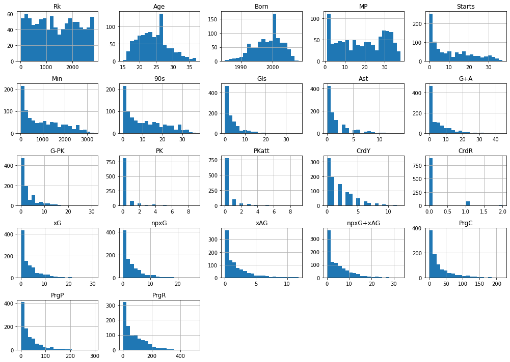
    


    
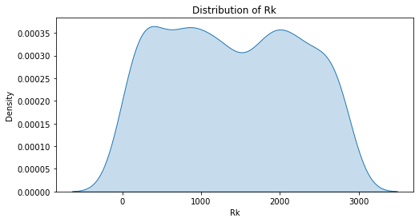
    


    
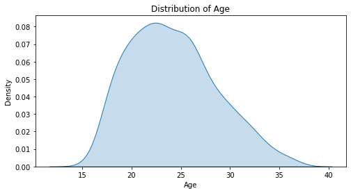
    


    
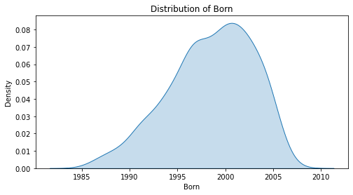
    


    
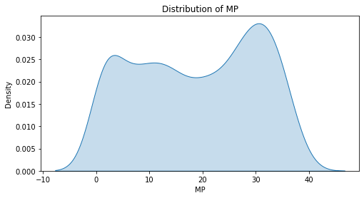
    


    
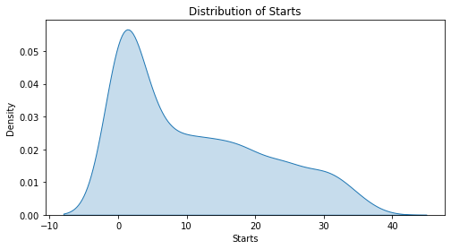
    


    
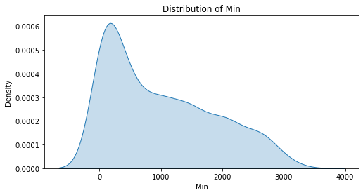
    


    
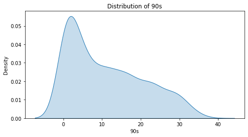
    


    
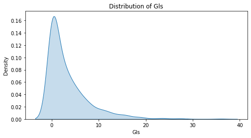
    


    
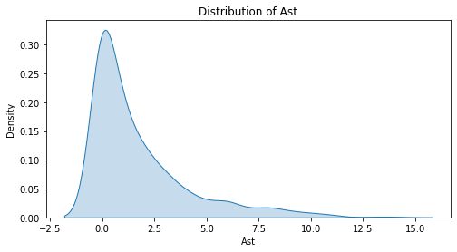
    


    
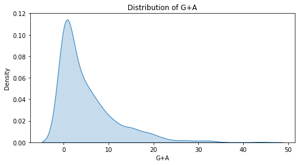
    


    
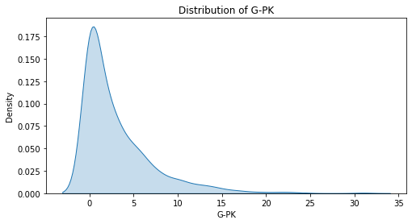
    


    
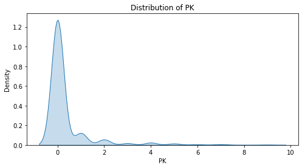
    


    
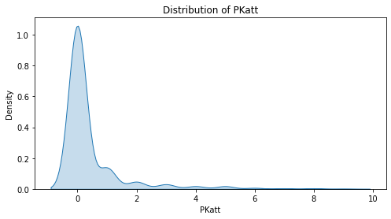
    


    
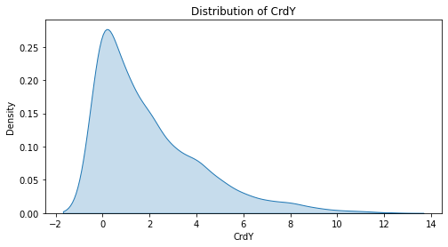
    


    
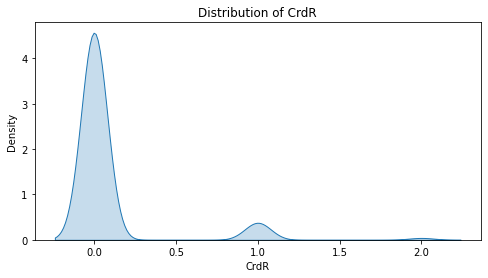
    


    
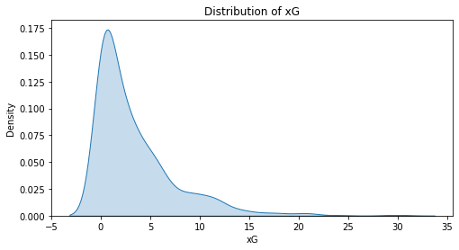
    


    
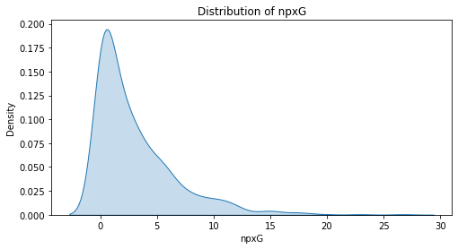
    


    
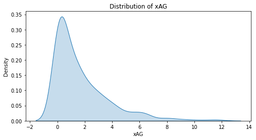
    


    
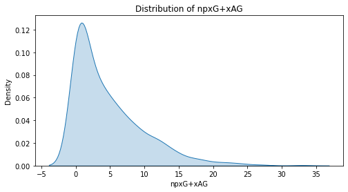
    


    
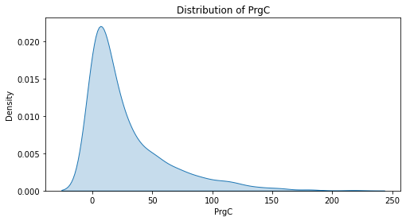
    


    
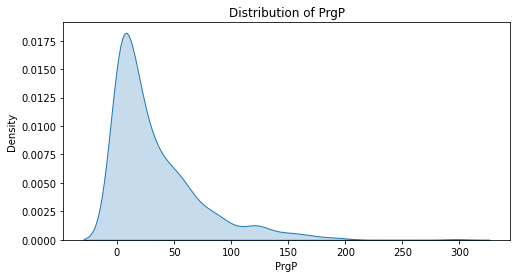
    


    
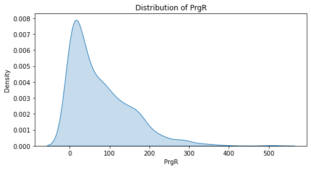
    


```python
plt.figure(figsize=(8, 6))
sns.scatterplot(data=data_fw, x='Min', y='G+A', alpha=0.7)
plt.title('Scatter Plot of Matches Played (MP) vs. Goals + Assists (G+A)')
sns.regplot(data=data_fw, x='Min', y='G+A', scatter_kws={'alpha':0.7})
plt.xlabel('Min Played(MP)')
plt.ylabel('Goals + Assists (G+A)')
plt.grid(True)
plt.show()
```


    
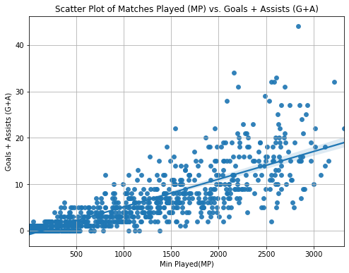
    


```python
plt.figure(figsize=(8, 6))
sns.scatterplot(data=data_fw, x='MP', y='npxG+xAG', alpha=0.7)
plt.title('Scatter Plot of Matches Played (MP) vs. Goals + Assists (npxG+A)')
sns.regplot(data=data_fw, x='MP', y='npxG+xAG', scatter_kws={'alpha':0.7})
plt.xlabel('Match Played(MP)')
plt.ylabel('xGoalsNP + xAssists (npxG+xA)')
plt.grid(True)
plt.show()
```


    
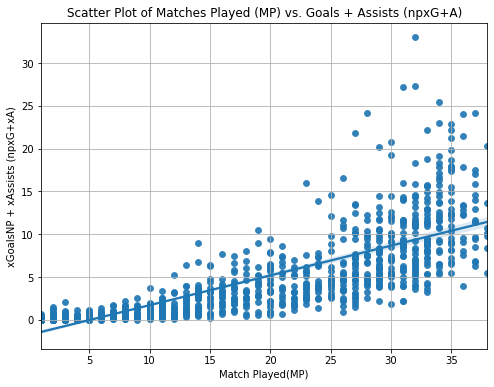
    


```python
data_fw1 = data_fw[(data_fw['G-PK'] != 0) & (data_fw['Min'] > 45*30)]
df1 = pd.DataFrame(data_fw1)

df1['R_G_Min'] = np.where(df1['Min'] > 1300, df1['Gls'] / df1['Min'], 0)
df1['R_G-PK_npxG'] = np.where(df1['G-PK'] > 10, df1['npxG'] / df1['G-PK'], 0)
df1['Eff'] = df1['R_G-PK_npxG'] + df1['R_G_Min']

df1.replace([np.inf, -np.inf], np.nan, inplace=True)
df1.dropna(subset=['Eff'], inplace=True)

top_20_eff = df1.nlargest(20, 'Eff')

print("Top 20 efficient players this Season:")
print(top_20_eff[['Player', 'Eff']])
```

    Top 20 efficient players this Season:
                             Player       Eff
    1925               Darwin Núñez  1.414465
    156   Pierre-Emerick Aubameyang  1.337253
    1206            Nicolas Jackson  1.333573
    2316              Mohamed Salah  1.199411
    1081             Erling Haaland  1.155580
    2515       Jørgen Strand Larsen  1.119925
    2589              Marcus Thuram  1.104838
    765                Artem Dovbyk  1.062218
    2469            Dominic Solanke  1.017479
    1405      Khvicha Kvaratskhelia  1.013110
    1472         Robert Lewandowski  1.006909
    1192             Alexander Isak  0.984313
    1108                Kai Havertz  0.971602
    1998             Victor Osimhen  0.957568
    2724             Dušan Vlahović  0.956935
    983              Olivier Giroud  0.933621
    627              Thijs Dallinga  0.913270
    2816               Duván Zapata  0.912500
    1982                Loïs Openda  0.904353
    2746              Ollie Watkins  0.890117
    
Création du nouvelle colonne Efficacité d'un joueur

```python
from sklearn.ensemble import RandomForestClassifier
from sklearn.model_selection import train_test_split
from sklearn.metrics import accuracy_score


X1 = df[[ 'Gls', 'xG','PrgC']]  
y1 = df['Gls']  

X_train, X_test, y_train, y_test = train_test_split(X1, y1, test_size=0.3, random_state=42)

model = RandomForestClassifier(n_estimators=100, random_state=42)
model.fit(X_train, y_train)

y_pred = model.predict(X_test)

accuracy = accuracy_score(y_test, y_pred)
print(f"Accuracy: {accuracy:.2f}")

df['Predicted_Gls'] = model.predict(X1)
top_20_attackers = df.nlargest(20, 'Predicted_Gls')
print("Top 20 Attackers for the Next Season:")
print(top_20_attackers[['Player', 'Predicted_Gls']])
```

    Accuracy: 0.89
    Top 20 Attackers for the Next Season:
                             Player  Predicted_Gls
    1297                 Harry Kane             36
    1064            Serhou Guirassy             27
    1081             Erling Haaland             27
    1690              Kylian Mbappé             27
    2316              Mohamed Salah             27
    765                Artem Dovbyk             24
    1643           Lautaro Martínez             24
    1982                Loïs Openda             24
    2542          Alexander Sørloth             23
    156   Pierre-Emerick Aubameyang             21
    1192             Alexander Isak             21
    647              Jonathan David             19
    885                  Phil Foden             19
    1412        Alexandre Lacazette             19
    1472         Robert Lewandowski             19
    2469            Dominic Solanke             19
    2657                Deniz Undav             19
    2746              Ollie Watkins             19
    398                Ante Budimir             17
    1138              Son Heung-min             17
    


```python
from sklearn.tree import DecisionTreeClassifier

X1 = df[[ 'Gls', 'xG','PrgC']]  
y1 = df['Gls']  

X_train, X_test, y_train, y_test = train_test_split(X1, y1, test_size=0.3, random_state=42)

# Création et entraînement du modèle
model = DecisionTreeClassifier(random_state=42)
model.fit(X_train, y_train)

# Prédictions
y_pred = model.predict(X_test)

# Évaluation du modèle
accuracy = accuracy_score(y_test, y_pred)
print(f"Accuracy: {accuracy:.2f}")

df['Predicted_Gls'] = model.predict(X1)
top_20_attackers = df.nlargest(20, 'Predicted_Gls')
print("Top 20 Attackers for the Next Season:")
print(top_20_attackers[['Player', 'Predicted_Gls']])
```

    Accuracy: 0.99
    Top 20 Attackers for the Next Season:
                             Player  Predicted_Gls
    1297                 Harry Kane             36
    1064            Serhou Guirassy             27
    1081             Erling Haaland             27
    1690              Kylian Mbappé             27
    765                Artem Dovbyk             24
    1643           Lautaro Martínez             24
    1982                Loïs Openda             24
    2542          Alexander Sørloth             23
    1192             Alexander Isak             21
    2026                Cole Palmer             21
    647              Jonathan David             19
    885                  Phil Foden             19
    1412        Alexandre Lacazette             19
    1472         Robert Lewandowski             19
    2469            Dominic Solanke             19
    2746              Ollie Watkins             19
    156   Pierre-Emerick Aubameyang             17
    398                Ante Budimir             17
    1138              Son Heung-min             17
    2316              Mohamed Salah             17
    

Ici, les modèles ont des bons scores mais l'analyse n'est pas très "fiable" car on a les données uniquement de l'an dernier;
